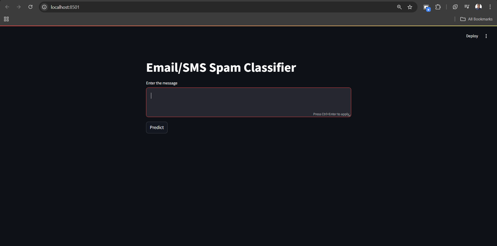

# SMS Spam Detection System

This repository hosts an SMS Spam Detection system built using a machine learning pipeline, designed to accurately classify text messages as either legitimate ("ham") or spam. The project emphasizes robust text preprocessing and utilizes a highly effective classification model.

## Web Page Screenshot

Here's a glimpse of the deployed SMS Spam Detection web interface:


## Features

* **Machine Learning Pipeline:** End-to-end implementation including data loading, preprocessing, feature extraction, model training, and evaluation.
* **High Performance:** The Multinomial Naive Bayes (MNB) model achieved excellent results:
    * **Accuracy:** 97%
    * **Precision:** 100%
* **Advanced Text Preprocessing:**
    * Utilized **Porter Stemmer** for reducing words to their root form.
    * Implemented **TF-IDF Vectorization** for converting text data into numerical features, capturing word importance.
* **Exploratory Data Analysis (EDA):** Insights gained from analyzing the SMS dataset to understand patterns and characteristics of spam vs. ham messages.
* **Model Evaluation:** Explored and evaluated various machine learning algorithms, including:
    * Gaussian Naive Bayes
    * Multinomial Naive Bayes (MNB)
    * Bernoulli Naive Bayes
    * Support Vector Classifier (SVC)
    * Random Forest Classifier

## How to Run Locally

To run this Streamlit application on your local machine:

1.  **Clone the repository:**
    ```bash
    git clone https://github.com/darshandugar2004/SMS-Spam-Detection
    cd your-repo-name
    ```
    
2.  **Create a virtual environment (recommended):**
    ```bash
    python -m venv venv
    # On Windows:
    .\venv\Scripts\activate
    # On macOS/Linux:
    source venv/bin/activate
    ```

3.  **Install dependencies:**
    Make sure your `requirements.txt` file is correctly set up with the required libraries:
    ```
    streamlit==1.47.0
    scikit-learn==1.5.1
    nltk==3.9.1
    pandas==2.3.1
    numpy==2.3.1
    ```
    Then install them:
    ```bash
    pip install -r requirements.txt
    ```

4.  **Download NLTK data:**
    The application will attempt to download `stopwords` and `punkt` on its first run if not found. Ensure you have an active internet connection.

5.  **Run the Streamlit application:**
    ```bash
    streamlit run app.py
    ```
    This will open the application in your web browser.

---
